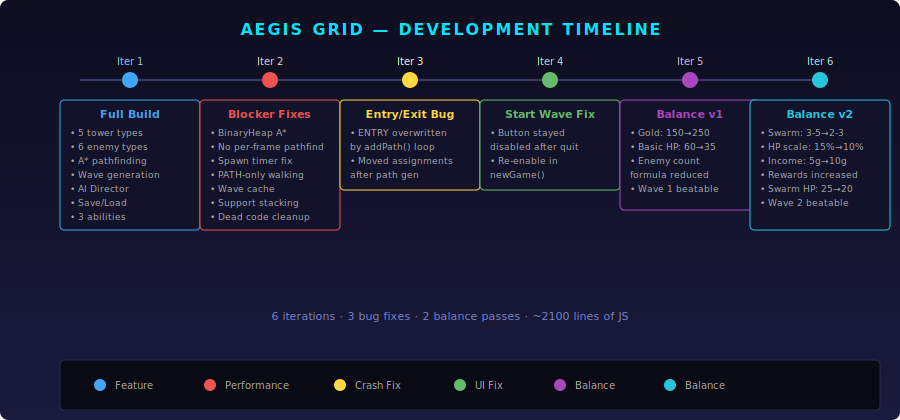

# Aegis Grid: Adaptive Defense — Development History

## Iterative Development Timeline

---

## Design Principles Established

| Principle | Description |
|-----------|-------------|
| **Path-only movement** | Enemies follow defined PATH tiles; buildable EMPTY tiles are tower placement zones |
| **Adaptive difficulty** | AI Director adjusts wave composition based on player leak rate (targets 5–15% flow state) |
| **Economy-driven strategy** | Starting gold allows 5 towers; passive income + kill rewards fund upgrades between waves |
| **Deterministic previews** | Wave preview shows exact composition that will spawn (cached generation) |
| **Efficient pathfinding** | Binary heap A* with caching; path recalculates only when towers are placed/sold |

---

## Iteration Log

### Iteration 1 — Initial Implementation

**Prompt:** Create the full tower defense game per `instructions.md` spec

**What was built:**
- Complete HTML5 Canvas game with menu, game, pause, and game-over screens
- Grid-based map (20×14) with S-shaped path, entry/exit points, blocked terrain
- 5 tower types: Basic, Splash, Slow, Sniper, Support (with branching upgrades)
- 6 enemy types: Basic, Tank, Swarm, Flying, Shielded, Adaptive
- A* pathfinding, object pooling, projectile system, status effects
- Wave manager with procedural generation and AI Director
- Player abilities: Airstrike, Freeze, Overclock
- Save/Load via LocalStorage
- Full HUD with health, gold, energy, wave info, tower panel

**Issues found by review:**
- A* used Array.sort() instead of priority queue (O(n² log n) per call)
- `canPlaceTower()` ran full pathfinding every render frame
- Spawn timer double-applied game speed
- `isWalkable()` included EMPTY tiles — enemies shortcut through buildable terrain
- Wave preview was non-deterministic (two separate random rolls)
- Support tower buffs overwrote instead of stacking

---

### Iteration 2 — Blocker Fixes

**What was fixed:**
- Replaced Array.sort() A* with BinaryHeap (O(n log n))
- Simplified `canPlaceTower()` to tile-type check only (no per-frame pathfinding)
- Fixed spawn timer to not divide by gameSpeed (was being decremented by gameDt already)
- Removed EMPTY from `isWalkable()` — enemies now follow PATH/ENTRY/EXIT only
- Added wave generation caching so preview matches actual spawned wave
- Support buffs now accumulate via `+=` from multiple support towers
- Cleaned up dead code (accumulator/fixedDt, duplicate enemy filter, expensive projectile lookup)

---

### Iteration 3 — Entry/Exit Tile Bug

**Bug:** `game.js:930 Uncaught TypeError: Cannot read properties of undefined (reading 'row')`

**Root cause:** ENTRY/EXIT tiles were set before the path generation loop, which overwrote them to PATH. `findEntryExitPoints()` found no ENTRY/EXIT tiles → `entryPoints[0]` was undefined.

**Fix:** Moved ENTRY/EXIT assignments to after the `addPath()` loops.

---

### Iteration 4 — Start Wave Button After Quit

**Bug:** After quitting to menu mid-wave and starting a new game, the Start Wave button stayed disabled.

**Root cause:** `newGame()` reset all game state but never re-enabled the button (only wave-complete logic did).

**Fix:** Added `document.getElementById('startWaveBtn').disabled = false` at end of `newGame()`.

---

### Iteration 5 — Wave Balance (Round 1)

**Bug:** Wave 1 was unbeatable — 9 enemies × 60 HP = 540 total HP vs 3 affordable towers at 45 combined DPS.

**Fix:**
- Starting gold: 150 → 250 (5 towers affordable)
- Basic enemy HP: 60 → 35 (killable in 2–3 shots)
- Base enemy count formula: `6 + diff×2` → `4 + diff×1.5` (fewer enemies early)

---

### Iteration 6 — Wave Balance (Round 2)

**Bug:** Wave 2 introduced swarm enemies (3–5 per roll × 7 rolls = up to 35 enemies) which overwhelmed early-game towers.

**Fix:**
- Swarm spawn count: 3–5 → 2–3 per roll
- HP scaling per wave: +15% → +10%
- Passive income: 5g → 10g per wave
- Kill rewards increased (Basic 5→8, Swarm 2→3, Tank 15→20)
- Swarm HP: 25 → 20 (one-shottable by basic towers)
