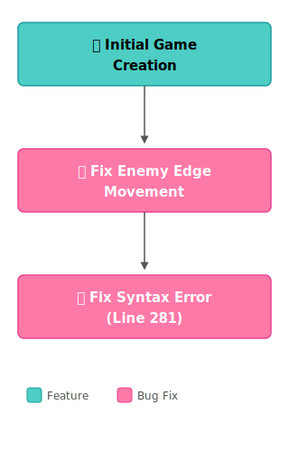

# Space Invaders — Development History

## Iterative Development Timeline

---

## Step-by-Step Changelog

### 1. 🚀 Initial Game Creation

Created a full Space Invaders game from scratch with three files:

- **`index.html`** — Canvas-based game container with start, game over, and win screens
- **`styles.css`** — Retro green-on-black aesthetic with neon glow effects
- **`game.js`** — Complete game engine including:
  - Player ship movement (arrow keys) and shooting (spacebar)
  - 4-row enemy grid with color-coded rows
  - Enemy lateral movement with descent on edge contact
  - Player and enemy bullet systems
  - Collision detection (AABB)
  - Score, lives, and 10-level progression system
  - Animated starfield background

### 2. 🐛 Fix Enemy Edge Movement

**Bug:** When invaders reached the screen edge, they entered an infinite reverse-and-descend loop, sliding straight down the screen and triggering an instant game over.

**Root cause:** The `updateEnemies()` function had two problems:
1. The boundary check and direction reversal were applied to all enemies globally, but the per-enemy clamping logic only applied to enemies literally at the boundary — inner enemies never got their direction flipped properly.
2. After clamping, the horizontal movement `enemy.x += enemy.direction * speed` was still applied on the same frame as the reversal, pushing edge enemies back out of bounds on the next frame, creating an infinite loop of reverse → descend → reverse → descend.

**Fix:** Rewrote the edge-detection logic so all alive enemies share a single `shouldReverse` flag, and when triggered, every enemy's direction is uniformly flipped while edge enemies are clamped to bounds. Enemies descend exactly once per reversal.

### 3. 🔧 Fix Syntax Error (Line 281)

**Bug:** `Uncaught SyntaxError: Unexpected token '<='` on line 281.

**Root cause:** During the previous edit, the boundary condition line was corrupted — `enemy.x <= 0` was truncated to just `enemy.x <=` with a bare newline, leaving an incomplete expression that the JS parser rejected.

**Fix:** Restored the complete condition: `enemy.x <= 0`.

---

## Design Notes

| Aspect | Implementation |
|--------|---------------|
| **Rendering** | HTML5 Canvas with `requestAnimationFrame` loop |
| **Difficulty** | Speed scales by kill ratio (fewer enemies → faster movement) |
| **Levels** | 10 total; enemy columns increase with level |
| **Scoring** | 10 × (row + 1) points per kill — top rows worth more |
| **Enemy fire** | Random shooter selection with level-scaled cooldown |
